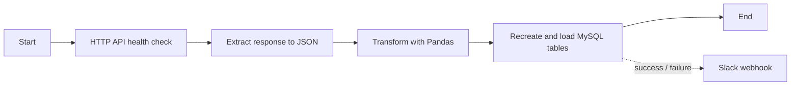
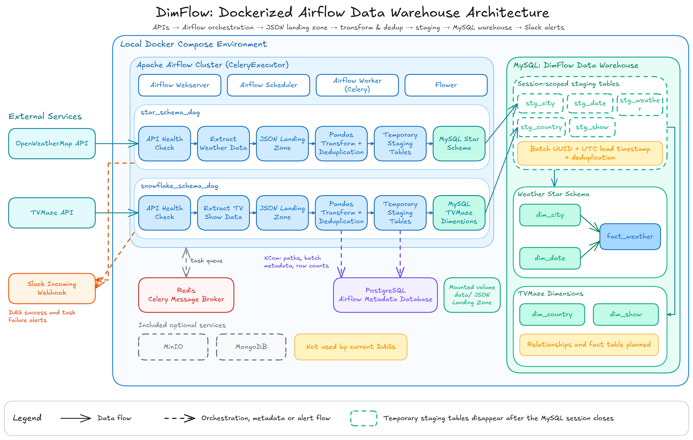
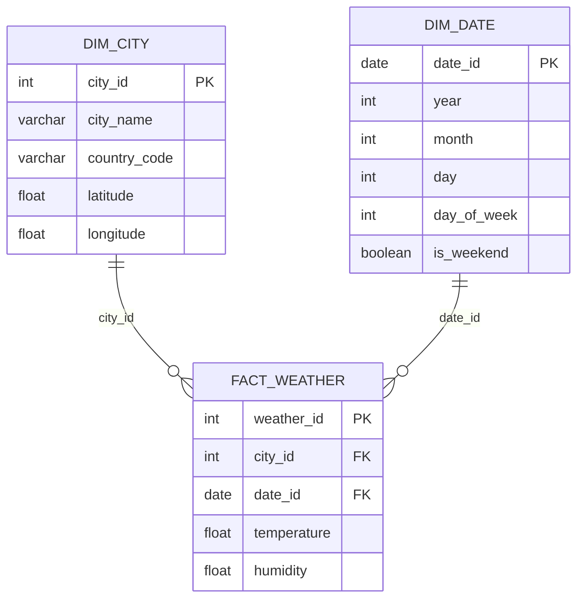
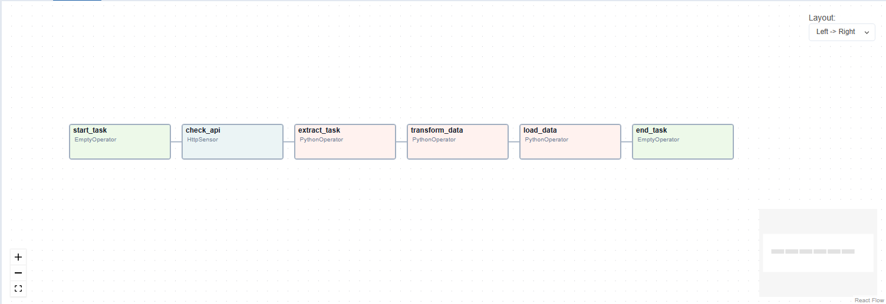
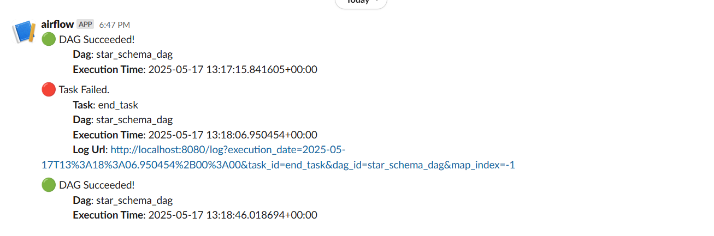
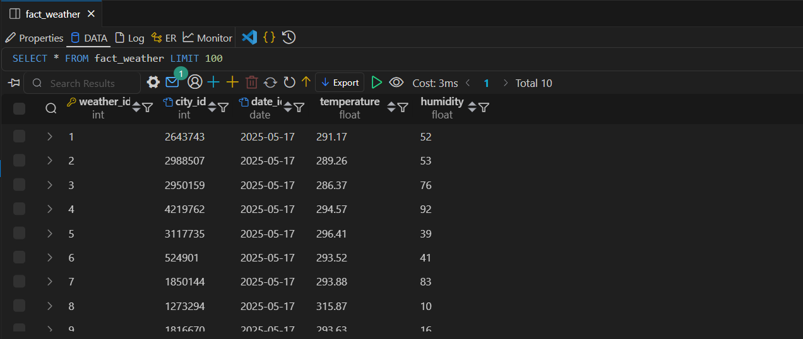

# DimFlow

Airflow-orchestrated ETL pipelines that collect public API data, transform it with Pandas, and load dimensional tables into MySQL. The local development environment is provided through Docker Compose, with Slack notifications for DAG success and task failures.

## Pipelines

| DAG | Source | Tables loaded | Status |
| --- | --- | --- | --- |
| `star_schema_dag` | OpenWeatherMap | `dim_city`, `dim_date`, `fact_weather` | Complete weather star-schema pipeline |
| `snowflake_schema_dag` | TVMaze | `dim_country`, `dim_show` | Dimension load implemented; relationships and a fact table are still pending |

Both DAGs are manual-triggered (`schedule_interval=None`) and follow the same high-level flow:



## Architecture



## Weather star schema



The weather pipeline collects data for London, Paris, Berlin, Rome, Madrid, Moscow, Tokyo, Delhi, Beijing, and New York. It generates `dim_date` rows from `2024-01-01` to `2025-12-31`. Temperatures use the unit returned by OpenWeatherMap (Kelvin by default).

> Every run drops and recreates the target tables. These are full-refresh demonstration pipelines, not incremental historical loads.

## Project structure

```text
.
├── dags/
│   ├── star_schema_dag.py          # OpenWeatherMap weather pipeline
│   └── snowflake_schema_dag.py     # TVMaze dimensions pipeline
|-- scripts/
|   |-- star_schema/
|   |   |-- ddl_scripts.py          # Weather and temporary staging DDL
|   |   `-- process_data.py         # Weather transformations and deduplication
|   `-- snowflake_schema/
|       |-- schema_ddl.py           # TVMaze and temporary staging DDL
|       `-- transform_data.py       # TV show/country transformations and deduplication
|-- data/                           # JSON landing files
|-- screenshots/                    # Example outputs
|-- Dockerfile.airflow              # Airflow 2.8.2 image
|-- docker-compose.yml              # Local services
`-- requirements.txt
```

## Prerequisites

- Docker Desktop with Docker Compose v2
- An [OpenWeatherMap API key](https://openweathermap.org/api) for `star_schema_dag`
- A Slack incoming-webhook URL for the current DAG callbacks

## Run locally

1. Clone the project.

   ```bash
   git clone https://github.com/logarajeshwarankarthikeyan/dimflow-airflow-data-warehouse.git
   cd dimflow-airflow-data-warehouse
   ```

2. Initialize Airflow, then start the services.

   ```bash
   docker compose up airflow-init
   docker compose up --build -d
   ```

3. Open Airflow at <http://localhost:8080>. The default development login is `airflow` / `airflow`.

4. In **Admin → Connections**, create the following connections.

   | Connection ID | Type | Configuration |
   | --- | --- | --- |
   | `api_connection` | HTTP | Host: `http://api.openweathermap.org` |
   | `tvmaze_api` | HTTP | Host: `https://api.tvmaze.com` |
   | `mysql_default` | MySQL | Host: `mysql`; Port: `3306`; Database: `airflow_db`; Username: `airflow_user`; Password: `airflow_pass` |
   | `slack_connection` | Slack Incoming Webhook | Configure with your webhook URL |

   MySQL is exposed on `localhost:3307` for connections made from the host machine.

5. In **Admin → Variables**, add:

   | Variable | Value |
   | --- | --- |
   | `API_KEY` | Your OpenWeatherMap API key |
   | `API_URL` | `https://api.tvmaze.com` |
   | `API_KEY_TV_MAZE` | Any non-empty value; the public TVMaze endpoint does not require a key |

6. Unpause and trigger either DAG from the Airflow UI.

## Local services

| Service | Host endpoint | Purpose |
| --- | --- | --- |
| Airflow webserver | <http://localhost:8080> | Airflow UI |
| Flower | <http://localhost:5555> | Celery worker monitoring |
| MySQL | `localhost:3307` | Warehouse target |
| PostgreSQL | `localhost:5432` | Airflow metadata database |
| Redis | `localhost:6379` | Celery broker |
| MinIO | <http://localhost:9001> | Included but unused by the current DAGs |
| MongoDB | `localhost:27017` | Included but unused by the current DAGs |

## Notes

- Landing files are written to `/opt/airflow/data` in the Airflow containers and retained in `data/` through a Docker volume mount.
- Tasks exchange landing-file paths and transformed records through Airflow XCom.
- Each load creates session-scoped `stg_*` tables. Staged rows receive a UUID batch ID and UTC load timestamp, then move to the warehouse in a single transaction. These temporary tables disappear when the MySQL connection closes; the batch ID, timestamp, and row counts remain available in the load task's Airflow XCom metadata.
- Transformations deduplicate cities by `city_id`, weather by `city_id` and `date_id`, shows by `tvmaze_id`, and countries by name before staging.
- The existing warehouse table definitions are unchanged: `weather_id`, `country_id`, and `show_id` remain database-generated surrogate keys. The current `city_id` and `date_id` remain their original natural keys.
- The TVMaze DAG extracts page `20`. It loads country names and show IDs/names into independent dimensions; its `fact_episode` table is only referenced in the drop statement and is not implemented.

## Example results







## Roadmap

- Add dimension relationships and a fact table for TVMaze data.
- Replace destructive full refreshes with idempotent incremental loads.
- Schedule weather collection and retain historical data.
- Convert temperatures to Celsius during transformation.
- Add data-quality checks and unit tests.

## Troubleshooting

View a service's logs:

```bash
docker compose logs -f airflow-scheduler
```

Reset all local containers and persistent volumes:

```bash
docker compose down -v
docker compose up airflow-init
docker compose up --build -d
```

This reset deletes the local Airflow metadata and MySQL warehouse data.

## License

MIT. See [LICENSE](LICENSE).
